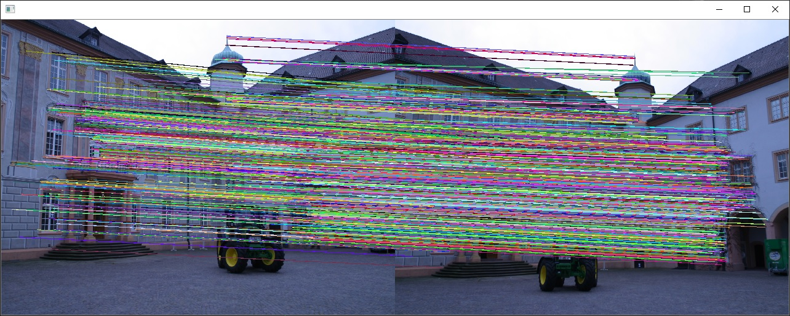
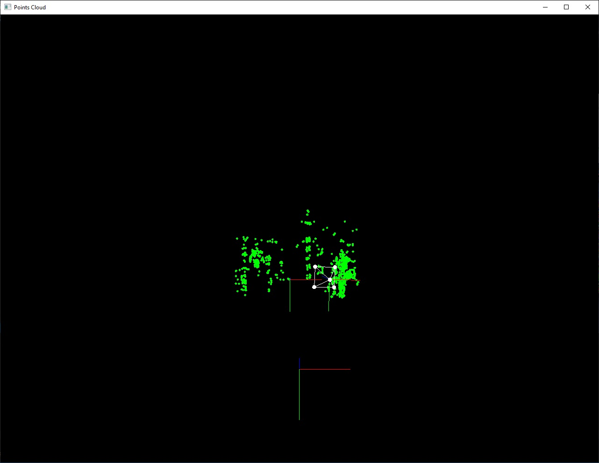

# SolAR Sample Triangulation

The SolAR **Triangulation sample** shows a SolAR pipeline that sparsely reconstructs a 3D scene given to viewpoints.

|  |  |
|:-:|:-:|
| Matching | Cloudpoint | 

## How to run

* If you want to change the calibration parameters of the camera, edit the [camera_calibration.json](./SolARSample_Triangulation_Mono/camera_calibration.json).

* To change properties of the components of the Triangulation pipeline, edit the [SolARSample_Triangulation_Mono_conf.xml](./SolARSample_Triangulation_Mono/SolARSample_Triangulation_Mono_conf.xml) file.

### StandAlone

To run it, launch:

> #### Windows
>
	SolARTriangulationSample.exe

> #### Linux
>
	./run.sh ./SolARTriangulationSample

You will visualize the 3D point cloud built from two viewpoints.

* Press `escape` to quit the application.

## Contact 
Website https://solarframework.github.io/

Contact framework.solar@b-com.com

